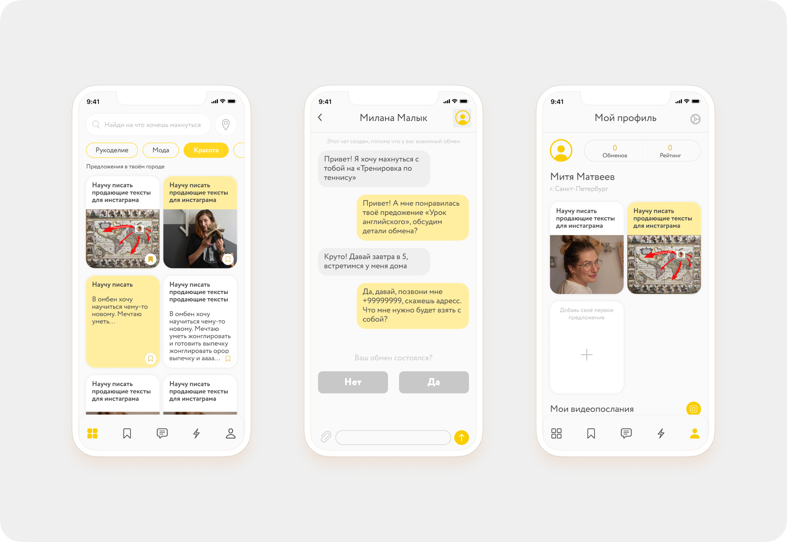
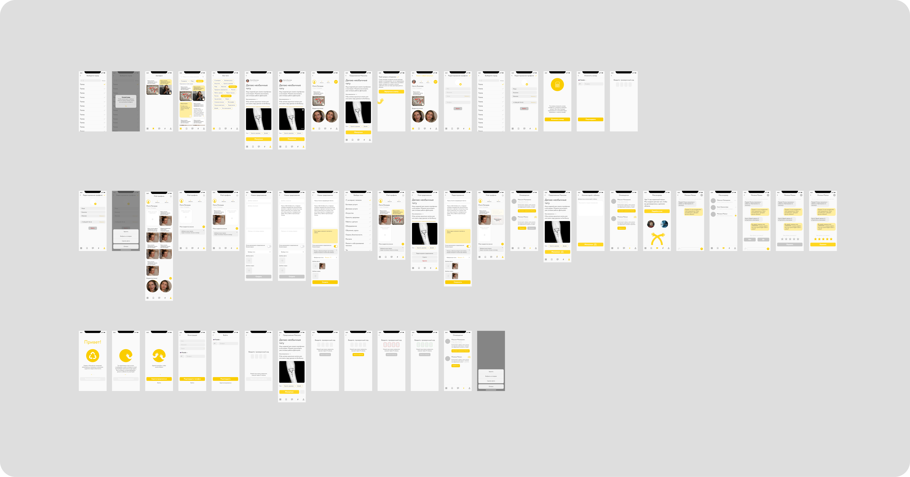

# Махнёмся
## Описание

#### &nbsp;&nbsp;&nbsp;&nbsp;&nbsp;&nbsp;&nbsp;&nbsp;&nbsp;Приложение позволяет обмениваться знаниями и умениями с другими людьми бесплатно. Вы предлагаете свои услуги и выбираете чужие, которые на ваш взгляд будут равноценны друг другу. Все основано на взаимодоверии, деньги в обмене не участвуют. [Полное описание проекта](https://portfolio.hse.ru/Project/87823#)

## Стек технологий
 </tr>
    <td> 
    <b style="font-size:15px">
    &nbsp;&nbsp;&nbsp;&nbsp;   ◦ SocketIO   
    &nbsp;&nbsp;&nbsp;&nbsp;  ◦ Alamofire, URLSession 
     &nbsp;&nbsp;&nbsp;&nbsp;  ◦ Autolayout, SnapKit  
      &nbsp;&nbsp;&nbsp;&nbsp;  ◦ Restful API 
        &nbsp;&nbsp;&nbsp;&nbsp;  ◦ Clean swift(VIP) 
         &nbsp;&nbsp;&nbsp;&nbsp;  ◦ Core animation  
         &nbsp;&nbsp;&nbsp;&nbsp;  ◦ MessageKit 
         &nbsp;&nbsp;&nbsp;&nbsp;  ◦ Kingfisher 
          &nbsp;&nbsp;&nbsp;&nbsp;   ◦ SwiftyBeaver(logging) 
           &nbsp;&nbsp;&nbsp;&nbsp;  ◦ SwiftyJSON, Decodable 
           </b>
    </td>
 </tr>
  
 

## Команда разработчиков:
<!-- <td> 
    <b style="font-size:20px">
    Дизайнеры
 </b>
</td> -->

### Дизайнеры
#### &nbsp;&nbsp;Авторы идеи, дизайна и механики приложения
<!-- ### *Авторы идеи, дизайна и механики приложения* -->
* Екатерина Кожара
* Мария Слабуха
#####  &nbsp;&nbsp;*Девушки хотели создать пространство,в котором люди смогут меняться  услугами бесплатно*

### Backend developer
* Лапшин Даниил (*Node.js, PostgreSQL, Express*)

### IOS developer
* Карпунькин Ярослав (*Swift, UIKit*)
